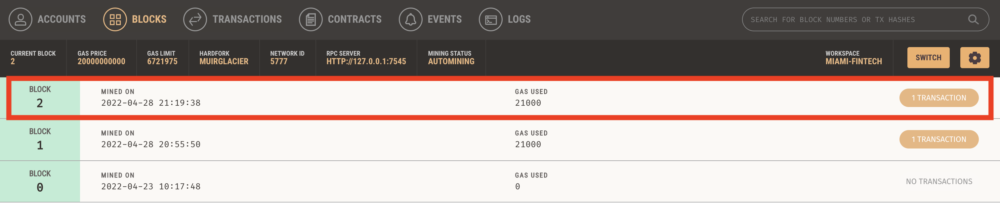
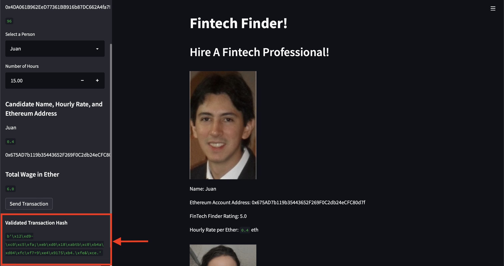
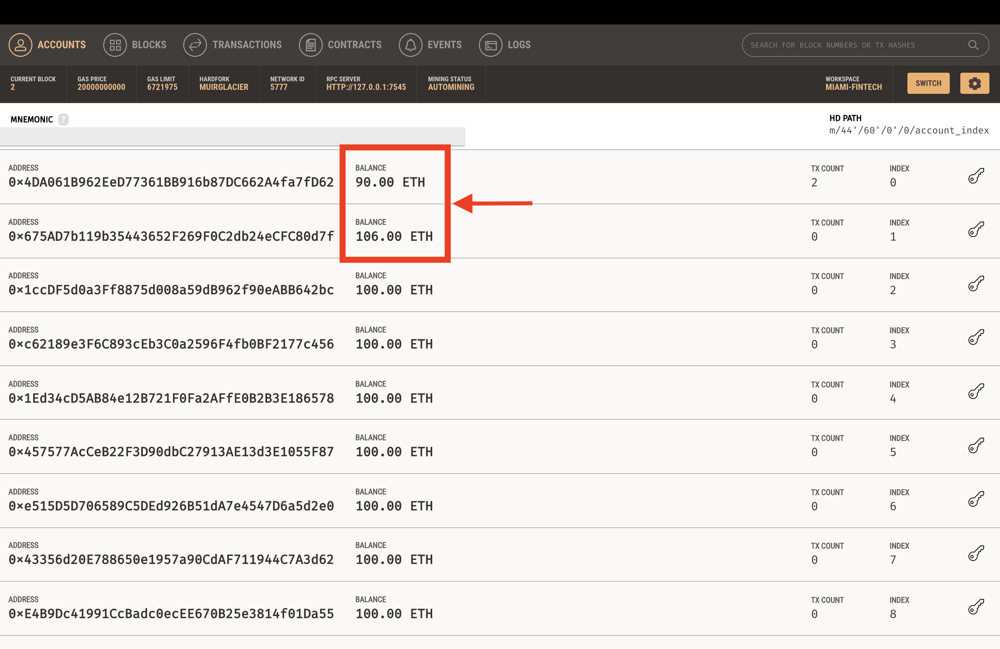

# Crypto Wallet

This project has been designed to demonstrate how a Cryptocurrency Wallet works.

## Fintech Finder:

Fintech Finder is an application that allows people to find fintech professionals from among a list of candidates, hire them, and pay them. 
For its development, it has been needed to  integrate the Ethereum blockchain network into the application in order to enable that the customers can instantly pay with cryptocurrency to the fintech professionals that they hired.
The finder application is made up of two files. 
One file contains the code associated with the web interface of Fintech Finder. The code included in this file is compatible with the Streamlit library.
The other file contains the Ethereum transaction functions that add the wallet operations to the application. 
By using import statements, these functions are integrated into the Fintech Finder interface program. 
Integrating these two files allows to automate the tasks associated with generating a digital wallet, accessing Ethereum account balances, and signing and sending transactions via a personal Ethereum blockchain called Ganache.

The customers using Fintech Finder can see in the center panel: the name, the ethereum account address, the rating and the hourly rate per Ether of each candidate.

In the left panel, users can visualize the following information:
- The available ethereum balance in the account. 
- A drop-down menu to select the candidate that wantted to be hired. 
- The number of hours to hire.
- The hourly rate in ETH.
- The total amount in ETH to be paid.

There is also in the left panel, a Send Transaction button, to effectively complete the payment of the service to the selected candidate.
Once the transaction is completed, the validated transaction hash is displayed to confirm it.

In the next steps it is explained how the payment is processed using a crypto wallet with the ethereum blockchain technology.

1. Select the Canditate and number of hours to hire

 

 

2. Check the initial balance in the Ganache application

 

3. Send the transaction

 

4. See block details

 

5. Chech the transaction details

 

6. Confirm validation

 

7. Verify the final balance

 

